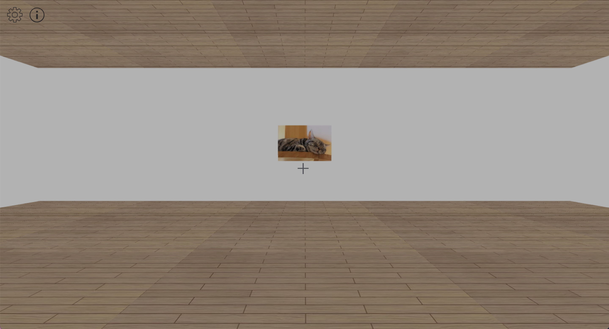
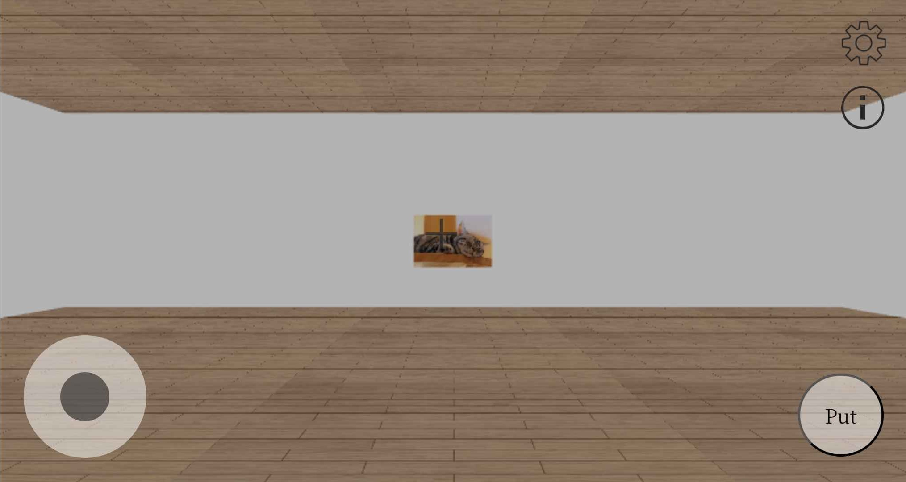

# My Museum

> **ブラウザで歩き回れる、自分だけの 3D ミュージアム。**
> 自分の画像を展示品として飾り、館内を一人称視点で見て回れます。PC でもスマートフォンでも動作します。
>
> **Three.js などの 3D ライブラリは使っていません。** WebGL を直接叩き、
> シェーダ・行列演算・物理・シャドウマッピングまで**すべて自前で実装**しています。


**English summary** — A walkable 3D museum in the browser. You can upload your own images and
display them as exhibits, then explore the hall in first person on desktop or mobile.
**No 3D library is used** — the WebGL renderer, matrix math, physics, and shadow mapping are all
written from scratch.



---

## 操作

### PC

| 操作 | 動作 |
|---|---|
| `W` / `A` / `S` / `D`（または矢印キー） | 前後左右に移動 |
| マウス | 視点操作 |
| 画像アップロード | 自分の画像を展示品として追加 |
| 情報アイコン | 操作方法のチュートリアルを表示 |

### スマートフォン

| 操作 | 動作 |
|---|---|
| バーチャルジョイスティック | 移動（`handlePointerDown` / `Move` / `Up` で実装） |
| 画面ドラッグ | 視点操作 |



---

## 技術的なポイント

### 1. 自前の WebGL レンダラ（`renderer.js` / 421 行）

Three.js を使わず、WebGL の API を直接操作しています。

- **GLSL シェーダを 2 系統** — 通常描画用と、影の深度を書き込むための深度パス用
  （`createProgram` / `createShader`）
- **シャドウマッピング** — フレームバッファに深度テクスチャを描画し
  （`bindFramebuffer` / `DEPTH_COMPONENT`）、本描画でライト空間行列
  （`uLightSpaceMatrix`）から影を判定
- 法線行列（`uNormalMatrix`）によるライティング、テクスチャのスケール指定
  （`uTextureScale`）で床をタイル状に貼る
- アンビエント＋ディフューズによる陰影

### 2. 自前の行列・ベクトル演算ライブラリ（`myMath.js` / 254 行）

`mat4` / `mat3` / `vec3` をゼロから実装しています。射影変換・ビュー変換・
法線変換・ライト空間変換に必要な演算をすべて自前で持っています。

### 3. 一人称視点の移動（`physics.js`）

キー入力とバーチャルジョイスティックの**両方**を同じ移動ロジックに集約し、
視点の回転角（yaw）に応じて進行方向を回転させています。PC とモバイルで
操作系が違っても、移動の挙動が一致します。

### 4. 自分の画像を展示する（`main.js`）

ファイル選択（`handleFileSelect`）→ **Base64 化**（`ImageToBase64`）→
WebGL テクスチャとして描画（`setImage` / `showImagePopup`）。
サーバーを持たない構成のため、画像はすべてクライアント側で完結して扱われます。

---

## 構成

```
index.html              エントリポイント（キャンバスと UI）
javascripts/
  main.js               起動・ゲームループ・画像アップロード・入力処理（283 行）
  renderer.js           WebGL レンダラ・シェーダ・シャドウマップ（421 行）
  myMath.js             mat4 / mat3 / vec3 の自前実装（254 行）
  physics.js            一人称視点の移動（53 行）
css/
  styles.css
images/
  floor_texture.png     床テクスチャ
  gear_icon.png         設定アイコン
  info_icon.png         情報アイコン
  tutorial_pc.png       PC 用チュートリアル
  tutorial_mobile.png   モバイル用チュートリアル
LICENSE                 Apache License 2.0
```

| 項目 | 値 |
|---|---|
| JavaScript 行数 | 1,011 |
| 外部 3D ライブラリ | **0** |
| シェーダプログラム | 2（本描画 + 深度パス） |

---

## 実行

`index.html` をブラウザで開くだけです。ビルドもサーバーも不要です。

```bash
start index.html        # Windows
open index.html         # macOS
```

> WebGL を直接使用しているため、ブラウザのハードウェアアクセラレーションが有効な
> 環境で実行してください。

---

## ライセンス

Apache License 2.0 — [`LICENSE`](LICENSE) を参照してください。
